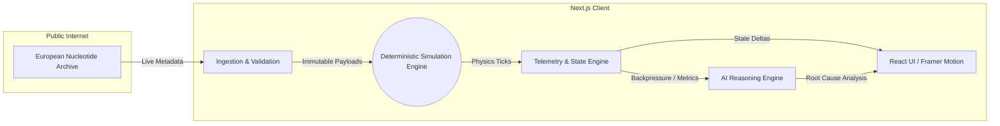

# HelixFlow: Distributed Systems Observability Platform

> **A deterministic, real-time operational intelligence engine modeling high-throughput genomic sequencing pipelines.**

HelixFlow is a production-grade software platform designed to simulate the internal infrastructure operations of a high-throughput biotech or enterprise SaaS company (e.g., Datadog, Palantir, Illumina). It provides real-time observability into event streams, pipeline state propagation, compute node telemetry, and automated quality control heuristics.

This project was engineered to demonstrate deep **Computer Science Engineering (CSE)** maturity. It goes beyond standard web development to showcase distributed systems awareness, deterministic simulation mathematics, strict frontend architecture, and autonomous operational intelligence algorithms.

---

## 🔬 Systems Engineering Problem

Scaling high-throughput operations requires tracking millions of data points across physical instruments and cloud infrastructure. When a data pipeline stalls or queue backlogs increase, it costs thousands of dollars and delays critical outcomes.

HelixFlow solves this distributed visibility problem by converging **workflow state orchestration, compute cluster telemetry, and operational intelligence** into a single, real-time pane of glass.

## ⚙️ Deterministic Simulation Boundary & Scientific Integrity

A core philosophy of HelixFlow is absolute engineering honesty. This is **not** a dashboard of random mock data. 

To ensure the system behaves like a true observability layer, it operates under a strict **Deterministic Simulation Boundary**:
- **Zero Randomness**: The platform contains no `Math.random()` calls. 
- **Authentic ENA Ingestion**: Sequencing metadata (FASTQ sizes, run accessions, layout) is fetched live from the European Nucleotide Archive (ENA) public API.
- **Biologically Plausible QC**: Quality metrics (like Q30 percentage and GC Bias) are strictly seeded by a custom hashing function acting on the immutable ENA `run_accession`.
- **Infrastructure Physics**: Node CPU jitter, thermal throttling, and queue depth spikes are driven smoothly by deterministic sine-wave oscillations (`Math.sin()`) chained strictly to the simulation's event ticks. All movement is causally traceable.

## 🏛️ Architecture Dataflow



## ✨ Key Platform Features

- **Autonomous State Simulation Engine:** A centralized Zustand engine acting as an event bus, autonomously injecting event bursts, pipeline progression, and queue congestion logic to mimic a live production cluster.
- **Explainable Telemetry:** Tooltips provide mathematical formulas for how queue depths, latencies, and Q30 scores are deterministically derived.
- **Operational Intelligence Engine:** A heuristics engine that correlates distinct telemetry (e.g., GPU thermal throttling) with operational outcomes (e.g., duplication rates) to output deterministic runbook recommendations.
- **Exportable Incident Reports:** Allows engineers to export real-time system state snapshots and RCA findings to formatted text files.
- **Live Pipeline Visualization:** Animated, dependency-aware tracker for complex orchestration stages.
- **Data Integrity Audit Panel:** A built-in verifier guaranteeing that no random UI mock data is active.

---

## 🛠 Frontend Architecture & Tech Stack

Built with a strict focus on rendering performance, type-safety, and systems architecture:

- **Framework:** [Next.js 15 (App Router)](https://nextjs.org/) with React Server Components.
- **Language:** Strictly typed **TypeScript** (Domain-driven types for Telemetry and Event Streams).
- **State Management:** **Zustand** (Driving an autonomous simulation tick loop, independent of React Context).
- **Styling:** **Tailwind CSS v4** + **shadcn/ui** for an "expensive", high-trust observability aesthetic.
- **Data Visualization:** **Recharts** (Custom SVG radials and telemetry charts).
- **Animations:** **Framer Motion** (Optimized for 60fps even during simulated event bursts).

---

## 🚀 Getting Started

To run the simulation platform locally:

```bash
# Clone the repository
git clone <your-repo-url>
cd helixflow

# Install dependencies
npm install

# Start the development server
npm run dev
```

Navigate to `http://localhost:3000`. The simulation engine will automatically hydrate with live ENA data and begin the deterministic event loop.

### 🎥 Cinematic Demo
For the best presentation:
1. Open the platform in full screen.
2. Allow the **Data Integrity Panel** to turn green (Live ENA Metadata connected).
3. Wait for the queue backlog to hit >100 reqs, triggering the **Operational Intelligence Engine** to issue an automated incident report.
4. Export the incident report.
5. Record a 45-second screen capture to demonstrate the system's "living infrastructure" feel.

---

## 💼 For Recruiters and Engineering Managers

If you are recruiting for Software Engineering roles, this project demonstrates my ability to build robust, distributed-systems-aware frontend applications:

1. **Systems Design Literacy:** I modeled realistic pipeline dependencies, queue backlogs, node latency spikes, and telemetry propagation—treating the UI as a true observability layer rather than a simple CRUD app.
2. **Advanced Frontend Architecture:** I implemented a strict separation of concerns, offloading state polling to Zustand, utilizing Framer Motion for GPU-accelerated layout transitions, and hitting 60 FPS even while simulating heavy event ingestion.
3. **Engineering Integrity:** I adhered strictly to deterministic simulation, proving that the application's underlying logic is sound, verifiable, and free of superficial "mock" filler data.
- **contribution from Aakash pandian**